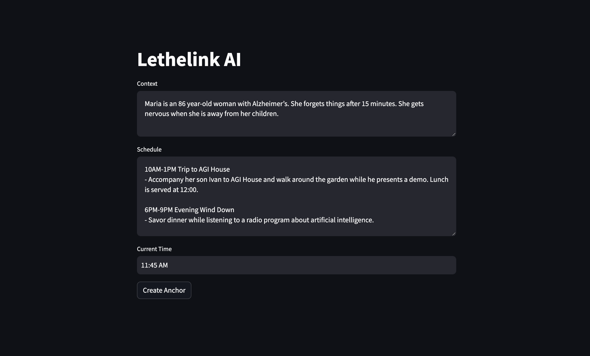
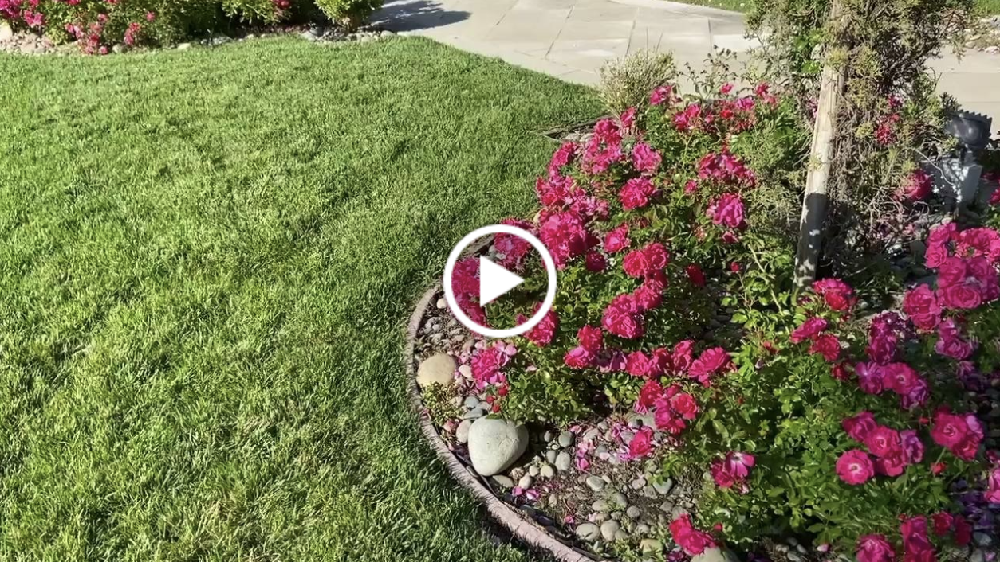

<div align="center">
 
</div>

# Lethelink

Lethelink is an interface to create grounding messages for people who suffer from anterograde amnesia, which a popular symptom of Alzheimer's. The messages can be delivered to the person's hearing aid on a schedule to prevent episodes of disorientation.

## Introduction

Caregivers can use Lethelink to create nudges that ground their Patient in reality, remind them they are safe, and help them orient in time and space. 

🌿 Anchors are context-aware. For example, they can learn what causes the Patient to feel anxious, or what their schedule looks like today.

🌿 With one voice sample, Lethelink can send anchors in the Caregiver's voice, which is more familiar to the Patient.

🌿 Prevent the onset of disorientation by selecting what causes an anchor to send: time, Patient's voice, or increased heartbeat.

The Caregiver can set the context for the anchor through a UI that looks like this:

<div align="center">
 
</div>

## Demo
 
In this demo, we show how a nudge generated from the voice of our teammate could help his elderly mother avoid the state of disorientation. 

<div align="center">
    <a href="https://youtu.be/kUsAV1t3ieg">
        
    </a>
</div>

Note: Lethelink v.0.1 is an MVP we built in one day. Its main purpose is to demonstrate the possibilities of combining powerful AI models in a thoughtful interface. This is by no means a finished product, and we encourage others to reuse our code and build on it. We may continue to build this out in the future.

## Opportunities

Lethelink is fully open-source, so you can build on it. Here are some ideas we are excited about:

Engineering
- Send nudges when the person's heartbeat spikes. Get data from their wearable.
- Build a more streamlined hearing aid integration.
- Create an end-to-end UI that connects all the pieces together.

Research
- Start an evidence-based clinical practice using nudges to help people with Alzheimer's.
- Research if people with amnesia learn to anticipate Lethelink and rely on it.

## Getting Started

**Note:** We walk through every step in this guide, but if you don't code and are not sure what to do, reach out to [Yaroslav](https://twitter.com/TheSlavant) to get help with the setup.

### Prerequisites

- An account at [ElevenLabs](https://elevenlabs.io/)
- An account at [OpenAI](https://platform.openai.com/overview)

### Installation & Setup

1. **Environment Variables Setup**
   Clone the Lethelink repository to your local machine. Inside the project directory, you need to set up your environment variables:

   - `ELEVEN_LABS_API_KEY`: API key generated from Eleven Labs.
   - `OPENAI_API_KEY`: API key generated from OpenAI.

   Use a `.env` file to store these variables and `python-dotenv` to load them.

2. **Set Voice Preference**
   In `app.py`, a default `VOICE_ID` for "Emily" is provided. This voice ID is specific to Eleven Labs. 
   Optional: If you want to fine-tune on the Caregiver's voice, go to [this page](https://elevenlabs.io/voice-lab), add a clear voice sample, and train the voice. Then update the `VOICE_ID` variable with the new ID.

3. **Install Dependencies**
   Use the provided command to install the required dependencies:
   ```bash
   pip install openai streamlit mutagen requests python-dotenv
   ```

4. **Run the Application**
   With Streamlit, run the app using the following command:
   ```bash
   streamlit run app.py
   ```

   By default, the application will be accessible at [http://localhost:8501](http://localhost:8501). 

   Because we expect most users to first experiment with promts and voices, Lethelink will help you save credits by caching generated text and audio to your local directory. So if you send the same prompt with the same voice, you will get an immediate, free response.

## Adapting for Your Use Case

- **Custom Prompts**: Modify the `generate_nudge` function in `app.py` to customize the prompting mechanism.
- **Voice Options**: Check Eleven Labs' documentation for different voice options and update the `VOICE_ID` accordingly.
- **Integrate with Other Models**: The application is currently set up for OpenAI's GPT-4 model. If you have access to different models, adjust the `call_chatgpt` function in the `utils` module.

## License

- License: MIT (feel free to use, modify, and distribute this code as you see fit).

## Contributing

Lethelink is fully open-source, and we welcome contributions! See [Opportunities](#opportunities) for ideas on what to contribute.
